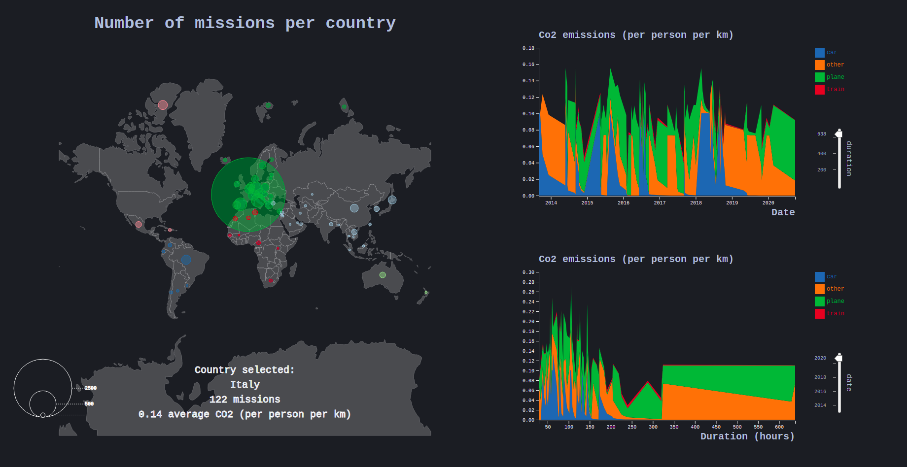

[](https://shields.io/)

<div align="center">
	<br>
	<br>
	
	<h1>Carbon Visualizations</h1>
	<p>
    <b>Visualizations of the co2 emitted during work travels by researchers.</b>
	</p>
	<br>
	<br>
	<br>
</div>

Some visualizations of [work travels by members of a research lab](https://gricad-gitlab.univ-grenoble-alpes.fr/blanchr/2020-carbon) using the [D3.js library](https://d3js.org/).

## Demonstration

<p align="center">
	
	<br>
</p>

## Instructions

Go to the root of the project.

```bash
cd Carbon-Visualizations
```

Run a http server using python for example.

```bash
python -m http.server
```

Go to the address where your server is serving ([local host on port 8000](http://0.0.0.0:8000/) by default using this command) and open `src/main.html`.

## Information

The dependencies of the source code are localized in the `vendor/` file.

* [D3.js library](https://d3js.org/).
* [d3-simple-slider library](https://github.com/johnwalley/d3-simple-slider).

## Features

* The colors can be changed with the module `Themes` by changing the value of `Themes.theme`.

## Attributions

* Visualizations made using the [D3.js library](https://d3js.org/).
* Sliders made using the [d3-simple-slider library](https://github.com/johnwalley/d3-simple-slider).
* Icon made by [Dimi Kazak](https://www.flaticon.com/authors/dimi-kazak) from [Flaticon](https://www.flaticon.com/).
